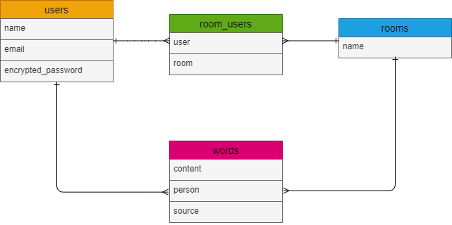
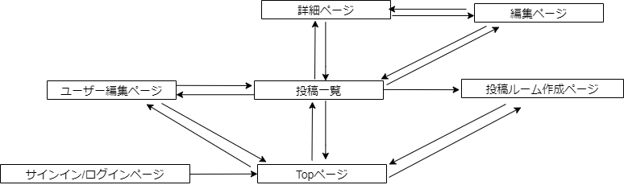

# README

This README would normally document whatever steps are necessary to get the
application up and running.

Things you may want to cover:

* Ruby version

* System dependencies

* Configuration

* Database creation

* Database initialization

* How to run the test suite

* Services (job queues, cache servers, search engines, etc.)

* Deployment instructions

* ...

# テーブル設計

## users テーブル

| Column             | Type   | Options     |
| ------------------ | ------ | ----------- |
| name               | string | null: false |
| email              | string | null: false |
| encrypted_password | string | null: false |

### Association

- has_many :room_users
- has_many :rooms, through: :room_users
- has_many :words

## rooms テーブル

| Column | Type   | Options     |
| ------ | ------ | ----------- |
| name   | string | null: false |

### Association

- has_many :room_users
- has_many :users, through: :room_users
- has_many :words

## room_users テーブル

| Column | Type       | Options                        |
| ------ | ---------- | ------------------------------ |
| user   | references | null: false, foreign_key: true |
| room   | references | null: false, foreign_key: true |

### Association

- belongs_to :room
- belongs_to :user

## words テーブル

| Column  | Type       | Options                        |
| ------- | ---------- | ------------------------------ |
| content | string     |                                |
| person  | string     |                                |
| source  | string     |                                |
| user    | references | null: false, foreign_key: true |
| room    | references | null: false, foreign_key: true |

### Association

- belongs_to :room
- belongs_to :user

# アプリケーション名

Memory_and_Record

# アプリケーション概要

本やドラマなどで心に残った言葉をジャンルごとに共有できる。文字数が多い時は画像で投稿することもできる。

# URL

https://memory-record-9pxc.onrender.com

# テスト用アカウント

- Basic認証パスワード：raika
- Basic認証ID：1300

投稿用アカウント
- メールアドレス：test1@test.com
- パスワード：11111a

閲覧用アカウント
- メールアドレス：test2@test.com
- パスワード：22222a

# 利用方法
## ログイン
アプリを開いたらログイン画面に遷移するので、ユーザー新規登録/ログインを行う
## 投稿ルームの作成
1. トップページ(一覧ページ)のヘッダーの「新規作成ボタン」を押すとルーム作成画面に遷移する
2. ルーム名に作りたいルームの名前を入力して、共有者に共有したい相手を選択したら「Create Room」を押す

## 心に残った言葉の投稿
1. トップページ(一覧ページ)に表示されているルーム名を押すと投稿内容表示ページに遷移する
2. 投稿内容表示ページの「投稿する」ボタンを押すと投稿ページに遷移する
3. 必須項目としてフォースに心に残った言葉を入力するか画像を選択(文字数が多い時など)、任意でその言葉を言った人と出典を入力する
4. 入力が済んだら「送信」ボタンを押す

## 投稿内容の詳細、編集、削除
1. 投稿内容表示ページに表示されているコメントの内、自分が投稿したコメントには「詳細　編集　削除」ボタンが表示され、他のユーザーが投稿したコメントには「詳細」ボタンが表示される
2. 「詳細」ボタンを押すとコメントの詳細を見ることができ、自分が投稿したコメントであれば「編集　削除」ボタンが表示される
3. 「編集」ボタンを押すと編集ページに遷移して、コメントの編集ができる
4. 「削除」ボタンを押すとコメントの削除ができる

# アプリケーションを作成した背景
これまでの読書で感動する言葉に出会うことが多く、それをメモしようと考えた。しかし、メモを紙やスマートフォンに取るときには以下の課題があった。
・長い言葉は紙へのメモでは読みにくいため写真で撮る場合があり、保存場所がバラバラになる
・紙でメモすると感じた順に書くため、後で読み返すときに整理が難しい 
また、これらのメモを共有できれば、未読の人が新しい本に興味を持つきっかけになるのではないかと思いついた。
私自身、本以外にもドラマやアニメ、音楽などで心に残った言葉をまとめた投稿を見かけ、その投稿をきっかけに新しい作品を発見することがありました。こういった様々なジャンルで心に残った言葉を共有する事ができれば、新たな作品を見つける手助けになるのではないかと考え、アプリケーションを開発することにした。

# 洗い出した要件
https://docs.google.com/spreadsheets/d/19nhl1I8QcBqvErB0AauDhZ1WNSx_bSD2BXbLImenTHQ/edit#gid=982722306

# 実装した機能についてのGIF
新規投稿ルーム作成
https://gyazo.com/a80562ad7fb691e2b6678a8a6aa3d3d2

新規投稿(画像なし)
https://gyazo.com/2ddf1181dcad2ed51754d158496bf2d6

詳細画面へ遷移
https://gyazo.com/520f0d835edb76922b4fc55ead2a079a

投稿内容編集
https://gyazo.com/cddea960fbd0aea33edee34ae98e88c0

別ユーザーが投稿内容と詳細画面を閲覧
https://gyazo.com/f5529c7651e1826fb9a22a39b06e24d8

投稿内容削除
https://gyazo.com/5ba4119ddbcedbe71b3e8f053e41a101

言葉のみを投稿した場合
https://gyazo.com/487acc890d191ad5e5a1ebb36f9d2c1e

画像のみを投稿した場合
https://gyazo.com/c5a2a27ed4be535bf5af3a277c3afc66

画像の変更
https://gyazo.com/16aea3ea72f036b6fdc5b1b5506506d5

必須項目を入力しないで投稿した場合
https://gyazo.com/f07c0fbccfb5cec8dda1b7cbca4e2c61

# 実装予定の機能
現在は投稿ルームを作成する時に他のユーザーを選択するが、ユーザーの選択ではなく公開か非公開を選択する様にする(非公開のルームは自分のみ閲覧可能)

# データベース設計

# 画面遷移図

# 開発環境
Ruby/Ruby on Rails/MySQL/Github/Visual Studio Code

# ローカルでの動作方法
以下のコマンドを順に実行
% git clone 
% cd memory_and_record

# 工夫したポイント
投稿したい言葉が長文の時は画像で投稿が出来るようにした。また、投稿を見た別のユーザーが作品を探せるように作品の情報を入力できる欄を用意し、その情報は詳細画面でのみ閲覧できるようにした。

# 改善点
補足情報として入力できる「人物」や「出典」の名義は再考すべきだと考えている。例えば、本であれば今の名義でも問題ないが、音楽には対応していない。どのジャンルにも対応するような名義にすることで、入力がしやすくなるはずだ。 また、画像の大きさによっては画面を下にスクロールした時に、サイドバーが途中で切れてしまっているのでサイドバーの高さも修正する必要がある。

# 製作時間
開発期間：11/3~
１日あたりの平均作業時間：4時間
合計：